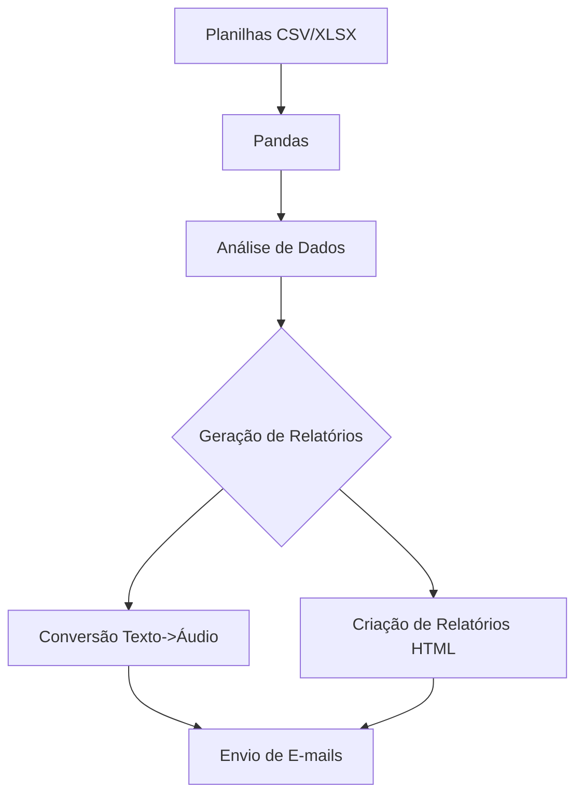

# 🧠 Ai-Data_Agent_Analysis

## 📌 Projeto

O **Ai-Data_Agent_Analysis** é um projeto focado na automação e análise de dados de suporte técnico, utilizando técnicas avançadas de inteligência artificial para gerar relatórios detalhados, insights profundos, e recomendações estratégicas. Este projeto exemplifica a aplicação de diversas tecnologias e boas práticas no desenvolvimento de soluções analíticas automatizadas.

# 🧠 Ai-Data_Agent_Analysis: Desvendando o Processo 🔍

## 🌟 Visão Geral do Processo

Este projeto envolve uma combinação poderosa de **manipulação de dados**, **automação**, e **inteligência artificial** para transformar dados brutos em relatórios e insights valiosos. Vamos explorar cada etapa deste processo, mostrando como as tecnologias se entrelaçam para alcançar resultados excepcionais.

---

## 🗃️ 1. Manipulação de Dados com Pandas

📊 **Entrada de Dados**: O processo começa com a leitura de dados de **planilhas** em formatos `.csv` ou `.xlsx`. Usando técnicas avançadas de manipulação de dados, essas planilhas são cuidadosamente processadas para garantir que os dados estejam prontos para análise.

📈 **Transformação**: A partir dessas planilhas, os dados são transformados, limpos e organizados, prontos para serem analisados. Esta etapa é crucial para garantir que a análise subsequente seja precisa e eficiente.

---

## 🤖 2. Análise com Inteligência Artificial

🧠 **Geração de Insights**: Com os dados prontos, entra em ação uma **IA Generativa** altamente sofisticada. Ela analisa os dados e gera **relatórios ricos em detalhes** e insights profundos, utilizando uma combinação de técnicas de aprendizado de máquina e processamento de linguagem natural.

💡 **Exploração de Dados**: A IA não apenas analisa os dados, mas também explora padrões ocultos, identifica **gargalos** e sugere **estratégias** de melhoria. Este é um passo essencial para transformar dados em ação.

---

## 📝 3. Geração de Relatórios Estilizados

📑 **Relatórios HTML**: Após a análise, os resultados são convertidos em relatórios **estilizados** em **HTML**. Isso permite que as informações sejam apresentadas de forma clara e visualmente atraente, com formatação cuidadosa que facilita a leitura e compreensão.

🎨 **Estilo e Apresentação**: O conteúdo é apresentado com **títulos**, **subtítulos** e **blocos de código** destacados, tudo projetado para garantir que os leitores recebam as informações de maneira envolvente e eficaz.

---

## 🎙️ 4. Conversão de Texto em Áudio

🔊 **Conversão de Texto**: Para tornar os relatórios acessíveis a todos, eles são convertidos em **áudio**. Utilizando técnicas de conversão de texto para fala, as informações são transformadas em arquivos de áudio que podem ser facilmente compartilhados e escutados.

🎧 **Disseminação das Informações**: Essa funcionalidade é ideal para cenários onde a leitura dos relatórios não é possível, permitindo que as informações sejam disseminadas de maneira prática e conveniente.

---

## 📧 5. Automação do Envio de E-mails

📬 **Entrega Automatizada**: Uma vez que os relatórios e áudios estão prontos, eles são enviados automaticamente para os destinatários relevantes via **e-mail**. Este processo é totalmente automatizado, garantindo que os relatórios cheguem rapidamente aos interessados.

📧 **Configuração e Segurança**: Todo o processo de envio é configurado para ser seguro e eficiente, utilizando protocolos de **SMTP** e garantindo que as informações confidenciais sejam transmitidas de maneira segura.

---

## 🔁 6. Ciclo Contínuo de Análise

🕒 **Monitoramento Contínuo**: O processo não para por aí. A cada intervalo definido, o sistema verifica novas planilhas e reinicia o ciclo de análise, garantindo que os relatórios estejam sempre atualizados com as informações mais recentes.

⚙️ **Eficiência e Escalabilidade**: Este ciclo contínuo garante que o sistema seja altamente eficiente, capaz de lidar com grandes volumes de dados e escalar conforme necessário para atender às demandas.

---

## 🛠️ Tecnologias e Boas Práticas Aplicadas

- **Automação**: Integração contínua e entrega automática de relatórios e áudios, reduzindo o tempo e esforço manual.
- **Análise de Dados**: Utilização de técnicas de ciência de dados para extrair insights valiosos e orientar a tomada de decisões.
- **IA Avançada**: Implementação de modelos de IA para fornecer análises e recomendações automatizadas com alta precisão.
- **Segurança**: Configurações robustas de segurança para proteger as informações e garantir a integridade dos dados durante a transmissão.

---

## 📅 Conclusão

O **Ai-Data_Agent_Analysis** é um exemplo claro de como a combinação de **automação**, **análise de dados**, e **inteligência artificial** pode transformar processos complexos em soluções eficientes e altamente escaláveis. Com uma abordagem focada em **eficiência** e **precisão**, este projeto demonstra a aplicação prática de tecnologias avançadas para resolver problemas reais de maneira inovadora.

---

## 🚀 Tecnologias e Ferramentas Utilizadas

| **Tecnologia**            | **Descrição**                                                                 |
|---------------------------|-------------------------------------------------------------------------------|
|  | **Pandas**: Manipulação e análise de grandes volumes de dados.                             |
|  | **Markdown**: Geração de relatórios HTML estilizados a partir de textos Markdown.           |
|  | **Google Generative AI**: Geração de relatórios e insights avançados usando AI.            |
|  | **SMTP**: Automação do envio de e-mails com relatórios e anexos de áudio.                   |
|  | **gTTS**: Conversão de texto em áudio para facilitar a disseminação de informações.         |
|  | **Regex**: Manipulação de strings e textos para limpeza de dados e preparação de inputs.    |

---

## 📑 Funcionalidades

### 🎯 Automação de Processos

- **Análise de Dados**: Extração, transformação e carregamento (ETL) de dados de suporte técnico, utilizando o poder da biblioteca Pandas para gerar insights.
- **Geração de Relatórios**: Criação de relatórios detalhados e estilizados em HTML a partir de arquivos Markdown, garantindo clareza e profissionalismo.
- **Conversão de Texto em Áudio**: Utilização do gTTS para transformar relatórios em áudio, facilitando a comunicação e a acessibilidade das informações.
- **Envio Automatizado de E-mails**: Integração com SMTP para envio de e-mails com relatórios e arquivos de áudio como anexo, garantindo que as partes interessadas recebam as informações em tempo real.

---

## 📈 Diagramas

### 🗂️ Fluxo de Processamento de Dados

🎨 Principais Conhecimentos Demonstrados
Manipulação de Dados: Habilidade em trabalhar com grandes volumes de dados, extraindo insights valiosos através de técnicas avançadas de análise.
Automação: Criação de processos automatizados que integram diversas tecnologias para alcançar um fluxo de trabalho eficiente e contínuo.
Inteligência Artificial: Implementação de modelos de IA para geração de relatórios inteligentes, oferecendo suporte estratégico com base em dados.
Engenharia de Software: Aplicação de boas práticas de codificação, como modularização, encapsulamento e documentação extensiva.
Comunicação: Geração de relatórios estilizados e acessíveis, tanto em formato visual quanto auditivo, utilizando HTML, Markdown e gTTS.

