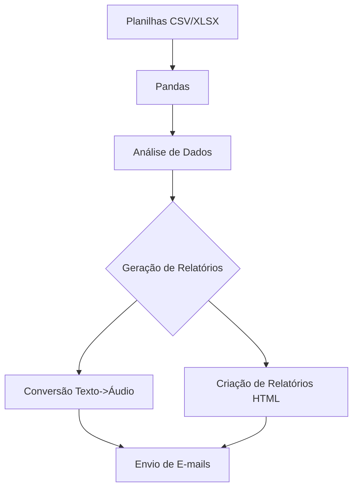
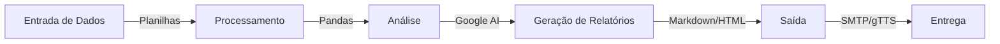

# 🧠 Ai-Data_Agent_Analysis

## 📌 Projeto

O **Ai-Data_Agent_Analysis** é um projeto focado na automação e análise de dados de suporte técnico, utilizando técnicas avançadas de inteligência artificial para gerar relatórios detalhados, insights profundos, e recomendações estratégicas. Este projeto exemplifica a aplicação de diversas tecnologias e boas práticas no desenvolvimento de soluções analíticas automatizadas.

---

## 🚀 Tecnologias e Ferramentas Utilizadas

| **Tecnologia**            | **Descrição**                                                                 |
|---------------------------|-------------------------------------------------------------------------------|
|  | **Pandas**: Manipulação e análise de grandes volumes de dados.                             |
|  | **Markdown**: Geração de relatórios HTML estilizados a partir de textos Markdown.           |
|  | **Google Generative AI**: Geração de relatórios e insights avançados usando AI.            |
|  | **SMTP**: Automação do envio de e-mails com relatórios e anexos de áudio.                   |
|  | **gTTS**: Conversão de texto em áudio para facilitar a disseminação de informações.         |
|  | **Regex**: Manipulação de strings e textos para limpeza de dados e preparação de inputs.    |

---

## 📑 Funcionalidades

### 🎯 Automação de Processos

- **Análise de Dados**: Extração, transformação e carregamento (ETL) de dados de suporte técnico, utilizando o poder da biblioteca Pandas para gerar insights.
- **Geração de Relatórios**: Criação de relatórios detalhados e estilizados em HTML a partir de arquivos Markdown, garantindo clareza e profissionalismo.
- **Conversão de Texto em Áudio**: Utilização do gTTS para transformar relatórios em áudio, facilitando a comunicação e a acessibilidade das informações.
- **Envio Automatizado de E-mails**: Integração com SMTP para envio de e-mails com relatórios e arquivos de áudio como anexo, garantindo que as partes interessadas recebam as informações em tempo real.

---

## 📈 Diagramas

### 🗂️ Fluxo de Processamento de Dados

🎨 Principais Conhecimentos Demonstrados
Manipulação de Dados: Habilidade em trabalhar com grandes volumes de dados, extraindo insights valiosos através de técnicas avançadas de análise.
Automação: Criação de processos automatizados que integram diversas tecnologias para alcançar um fluxo de trabalho eficiente e contínuo.
Inteligência Artificial: Implementação de modelos de IA para geração de relatórios inteligentes, oferecendo suporte estratégico com base em dados.
Engenharia de Software: Aplicação de boas práticas de codificação, como modularização, encapsulamento e documentação extensiva.
Comunicação: Geração de relatórios estilizados e acessíveis, tanto em formato visual quanto auditivo, utilizando HTML, Markdown e gTTS.

